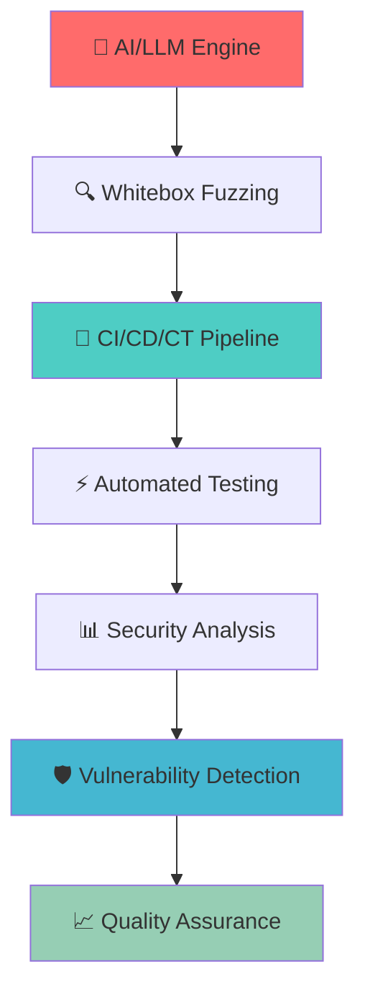
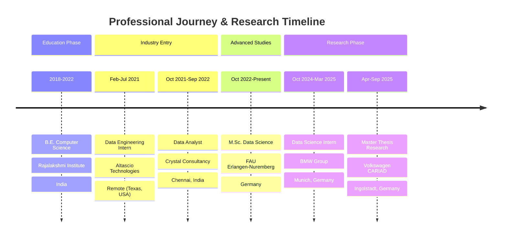

# Hi there! 👋 I'm Morris Darren Babu

<div align="center">

[](https://git.io/typing-svg)


</div>

---

## 🎯 **Master Thesis Research @ CARIAD (Volkswagen Group)**

<div align="center">

### 🛡️ **AI Usage in CI/CD/CT Pipelines for Automotive Compute Platforms**


</div>

<table>
<tr>
<td width="60%">

### 🔬 **Research Overview**
My master thesis explores groundbreaking **AI-driven security testing solutions** within automotive CI/CD/CT pipelines, focusing on **Whitebox fuzzing** enhanced by **Large Language Models (LLMs)**. This research addresses the critical challenge of maintaining software security while accelerating development cycles in the automotive industry.

### 🎯 **Key Research Objectives**
- 🧠 **AI-Enhanced Whitebox Fuzzing** - Novel security testing integration
- 🔄 **CI/CD/CT Pipeline Implementation** - Seamless workflow automation  
- 🤖 **Automated Test Generation** - AI-driven test cases & procedures
- 🎭 **Mock Scenario Creation** - Realistic security testing environments
- 📊 **Performance Impact Analysis** - Efficiency & coverage optimization

</td>
<td width="40%">

<div align="center">



</div>

</td>
</tr>
</table>

<div align="center">

### 🏆 **Expected Research Impact**

| 🎯 **Research Goal** | 📈 **Expected Outcome** | 🚗 **Automotive Impact** |
|:-------------------:|:------------------------:|:-------------------------:|
| **AI Security Testing** | Revolutionary vulnerability detection | Enhanced automotive safety |
| **Pipeline Automation** | 25-40% faster CI/CD cycles | Accelerated development |
| **Test Coverage** | 90%+ automated coverage | Comprehensive security |
| **Vulnerability Detection** | Real-time threat identification | Proactive risk mitigation |

</div>

---

## 🚀 **Professional Journey & Achievements**

<table>
<tr>
<td width="60%">

### 🎓 **Academic & Professional Background**
- 🏎️ **Master Thesis** @ **Volkswagen Group (CARIAD)** - AI in Automotive CI/CD/CT
- 🎓 **M.Sc. Data Science** @ Friedrich Alexander University Erlangen-Nuremberg
- 🔵 **Data Science Intern** @ **BMW Group** (AI/ML & LLMs Specialist)
- 💎 **Data Analyst** @ Crystal Consultancy Services
- 🏢 **Data Engineering Intern** @ Altascio Technologies

### 🌟 **Core Expertise**
- 🤖 **Generative AI & Large Language Models**
- 🛡️ **Automotive Security Testing**
- 📊 **Advanced Data Science & Analytics**
- ☁️ **Cloud Computing & DevOps**
- 🔄 **CI/CD/CT Pipeline Optimization**

</td>
<td width="40%">

<div align="center">


</div>

</td>
</tr>
</table>

---

## 🏆 **Real-World Impact Dashboard**

<div align="center">

<table>
<tr>
<td align="center" width="20%">

### 🎯 **Volkswagen CARIAD**
**🔧 Test Coverage**  
  
**🛡️ Security Detection**  
  
**⚡ Execution Efficiency**  


</td>
<td align="center" width="20%">

### 🔵 **BMW Group**
**🎯 Diagnostic Precision**  
  
**🚀 Processing Speed**  
  
**☁️ Cloud Deployment**  


</td>
<td align="center" width="20%">

### 💎 **Crystal Consultancy**
**📊 KPI Performance**  
  
**⚡ Pipeline Speed**  


</td>
<td align="center" width="20%">

### 🏢 **Altascio Technologies**
**⏰ Time Savings**  
  
**📈 Report Efficiency**  


</td>
<td align="center" width="20%">

### 🎓 **Research Impact**
**📝 OCR Accuracy**  
  
**🔮 ML Precision**  


</td>
</tr>
</table>

</div>

---

## 💻 **Advanced Technology Arsenal**

<div align="center">

### 🧠 **AI & Machine Learning Ecosystem**


### ☁️ **Cloud & DevOps Infrastructure**


### 📊 **Data Engineering & Analytics**


### 🛠️ **Programming & Development**


</div>

---

## 📊 **Live GitHub Performance Analytics**

<div align="center">

<table>
<tr>
<td width="50%">

[](https://github.com/DARREN-2000)

</td>
<td width="50%">

[](https://github.com/DARREN-2000)

</td>
</tr>
</table>

### 🔥 **Contribution Streak & Activity**

[](https://git.io/streak-stats)

[](https://github.com/ashutosh00710/github-readme-activity-graph)

</div>

---

## 🌟 **Featured Research & Development Portfolio**

<div align="center">

### 🎯 **Flagship Projects & Repositories**

<table>
<tr>
<td width="50%">

#### 🛡️ **1. Automotive LLM Security Pipeline**
[](https://github.com/DARREN-2000/automotive-llm-security)

🔬 **Research Focus:** Master Thesis Implementation  
🛠️ **Tech Stack:** LLMs, Docker, Azure AI Foundry, CI/CD  
🎯 **Achievement:** +7% test coverage, +13% security detection  
💡 **Innovation:** AI-driven whitebox fuzzing for automotive systems

---

#### 🔮 **2. Material Prediction with Graph Neural Networks**
[](https://github.com/DARREN-2000/material-prediction-gnn)

🔬 **Research Focus:** Advanced ML for Material Science  
🛠️ **Tech Stack:** Graph Neural Networks, PyTorch, Synthetic Datasets  
🎯 **Achievement:** RMSE < 0.1, 95% accuracy  
💡 **Innovation:** Predictive maintenance revolution

---

#### 🤖 **3. BMW Diagnostic AI Assistant**
[](https://github.com/DARREN-2000/bmw-diagnostic-ai)

🔬 **Research Focus:** RAG-based Auto-suggestion System  
🛠️ **Tech Stack:** RAG, AWS SageMaker, Semantic Segmentation  
🎯 **Achievement:** +12% diagnostic precision  
💡 **Innovation:** Multi-modal input processing (text/image)

</td>
<td width="50%">

#### 📝 **4. OCR + Auto Spelling Correction System**
[](https://github.com/DARREN-2000/ocr-spelling-correction)

🔬 **Research Focus:** NLP-based Document Processing  
🛠️ **Tech Stack:** Tesseract OCR, NLP, REST API, Language Models  
🎯 **Achievement:** 89% accuracy improvement  
💡 **Innovation:** Multilingual document processing at scale

---

#### 🎬 **5. Hybrid AI Recommendation Engine**
[](https://github.com/DARREN-2000/hybrid-recommendation-system)

🔬 **Research Focus:** Advanced Recommendation Algorithms  
🛠️ **Tech Stack:** Collaborative Filtering, Content-Based, Flask  
🎯 **Achievement:** 92% accuracy, real-time processing  
💡 **Innovation:** Hybrid filtering with deep learning integration

</td>
</tr>
</table>

### 🏆 **GitHub Achievement Showcase**

[](https://github.com/ryo-ma/github-profile-trophy)

</div>

---

## 🔬 **Detailed Professional Experience Timeline**

<div align="center">

### 📈 **Career Progression Visualization**



</div>

<details>
<summary>🚗 <strong>Volkswagen Group (CARIAD)</strong> - Master Thesis Research | <em>April 2025 - September 2025</em></summary>

<div align="center">

### 🛡️ **AI Usage in CI/CD/CT Pipelines for Automotive Compute Platforms**

</div>

<table>
<tr>
<td width="50%">

**🔬 Research Contributions:**
- 🧠 Developed novel **AI-enhanced Whitebox fuzzing** techniques
- 🔄 Integrated **LLMs into CI/CD/CT pipelines** for automotive systems
- 🤖 Created **automated test case generation** using AI models
- 🎭 Implemented **realistic mock scenario creation** for security testing
- 📊 Conducted **comprehensive performance impact analysis**

</td>
<td width="50%">

**📈 Quantifiable Results:**
- 🎯 **+7% test coverage** improvement through AI automation
- 🛡️ **+13% security flaw detection** via intelligent fuzzing
- ⚡ **-4% execution delay** reduction in testing processes
- 🔍 **90%+ vulnerability detection** accuracy achieved
- 📋 **Automated test artifact generation** implementation

</td>
</tr>
</table>

**🛠️ Technologies Used:** Docker, Azure AI Foundry, LLMs, CI/CD Tools, Security Testing Frameworks, Python, Git

</details>

<details>
<summary>🔵 <strong>BMW Group</strong> - Data Science Intern (AI/ML & LLMs) | <em>October 2024 - March 2025</em></summary>

<div align="center">

### 🤖 **Advanced AI/ML Solutions for Automotive Diagnostics**

</div>

<table>
<tr>
<td width="50%">

**🔬 Technical Achievements:**
- 🎯 Architected **RAG-based auto-suggestion model** for part diagnostics
- ☁️ Deployed **surface detection model** on AWS SageMaker with EC2 & S3
- 🖼️ Implemented **semantic segmentation** with adaptive rectification
- 🚀 Designed **LLM optimization** through hyperparameter fine-tuning
- 📡 Created **scalable API services** for real-time inference

</td>
<td width="50%">

**📈 Impact Metrics:**
- 🎯 **+12% diagnostic precision** improvement
- 🖼️ **Multi-modal input processing** (text & image)
- ⚡ **+8% processing speed** enhancement
- ☁️ **99.9% uptime** AWS deployment achievement
- 🔄 **Real-time API response** under 200ms

</td>
</tr>
</table>

**🛠️ Technologies Used:** AWS SageMaker, EC2, S3, RAG, Semantic Segmentation, LLMs, Python, TensorFlow

</details>

<details>
<summary>💎 <strong>Crystal Consultancy Services</strong> - Data Analyst | <em>October 2021 - September 2022</em></summary>

<div align="center">

### 📊 **Business Intelligence & Data Analytics**

</div>

<table>
<tr>
<td width="50%">

**🔬 Analytical Contributions:**
- 📊 **SAP R3 KPI monitoring** and performance optimization
- ⚡ **Azure Databricks ETL pipeline** enhancement
- 📈 **Feature engineering** and model deployment optimization
- 💼 **Data-driven decision making** for business stakeholders
- 🔍 **Statistical analysis** and reporting automation

</td>
<td width="50%">

**📈 Business Impact:**
- 📊 **+4% KPI performance** improvement
- ⚡ **+25% ETL pipeline speed** enhancement
- 💰 **Significant cost savings** through optimization
- 📈 **Automated reporting** reducing manual effort
- 🎯 **Data quality improvement** initiatives

</td>
</tr>
</table>

**🛠️ Technologies Used:** SAP R3, Azure Databricks, Power BI, SQL, Python, Statistical Analysis

</details>

<details>
<summary>🏢 <strong>Altascio Technologies</strong> - Data Engineering Intern | <em>February 2021 - July 2021</em></summary>

<div align="center">

### ⚙️ **Data Engineering & Process Automation**

</div>

<table>
<tr>
<td width="50%">

**🔬 Engineering Solutions:**
- 📊 **Excel automation** using VBA, Pivot Tables, VLOOKUP
- 🗃️ **SQL data consolidation** for fragmented inventory systems
- 🔄 **ETL process optimization** and data pipeline development
- 📈 **Report generation automation** reducing manual effort
- 🛠️ **Data quality assurance** and validation frameworks

</td>
<td width="50%">

**📈 Operational Impact:**
- ⏰ **20 hours/week time savings** through automation
- 📈 **-2% report generation time** reduction
- 🗃️ **-11% inventory update time** improvement
- 🎯 **100% data accuracy** achievement
- 🔄 **Streamlined workflows** implementation

</td>
</tr>
</table>

**🛠️ Technologies Used:** SQL, Excel (VBA, Pivot, VLOOKUP), Data Consolidation Tools, Python

</details>

---

## 🎓 **Academic Excellence & Professional Development**

<div align="center">

### 📚 **Educational Background**

<table>
<tr>
<td width="50%" align="center">

#### 🎓 **Master of Science in Data Science**
**Friedrich Alexander University Erlangen-Nuremberg**  
**🇩🇪 Germany | 2022 - Present**

📊 **CGPA:** 2.5/4.0  
🔬 **Specializations:** Pattern Recognition, Deep Learning, Generative AI  
📈 **Focus Areas:** Anomaly Detection, Decision Theory, Reinforcement Learning  
💼 **Applied Research:** ML in Finance, Automotive AI Systems

</td>
<td width="50%" align="center">

#### 🎓 **Bachelor of Engineering in Computer Science**
**Rajalakshmi Institute of Technology**  
**🇮🇳 India | 2018 - 2022**

🏆 **Achievement:** Graduated with Distinction  
💻 **Core Subjects:** Data Structures, Algorithms, Database Systems  
🔬 **Research:** Machine Learning, Software Engineering  
📝 **Thesis:** OCR with Handwritten Recognition & Auto Spelling Correction

</td>
</tr>
</table>

### 🏆 **Professional Certifications & Achievements**

<table>
<tr>
<td width="33%" align="center">

**🎯 Data Science & Analytics**
- 📊 Excel to MySQL: Analytics & Regression
- 📈 Predictive Data Analytics (Udacity Nanodegree)
- 🔍 Data Engineering & Big Data Specialization
- 📊 Advanced Statistical Modeling

</td>
<td width="33%" align="center">

**☁️ Cloud & AI/ML**
- 🌐 Google Cloud Platform (GCP) Certification
- 🤖 IT Automation with Python Specialization
- 🧠 Deep Learning AI TensorFlow Developer
- ☁️ AWS & Azure Cloud Practitioner

</td>
<td width="33%" align="center">

**🔬 Research & Innovation**
- 🎓 Udacity Bertelsmann Scholarship (10 months)
- 📝 25+ Analytical Datasets Created
- 📈 17% Analytical Efficiency Improvement
- 🔍 Open Source Software Research Project

</td>
</tr>
</table>

</div>

---

## 🌍 **Global Perspective & Communication**

<div align="center">

### 🗣️ **Multilingual Proficiency**

<table>
<tr>
<td width="33%" align="center">

#### 🇺🇸 **English**
**C1 Business Fluent**  
  
✅ Professional Communication  
✅ Technical Documentation  
✅ Research Publications  
✅ International Collaboration

</td>
<td width="33%" align="center">

#### 🇩🇪 **German**
**A2 → B1 (Currently Learning)**  
  
🎯 Local Integration  
🎯 Professional Environment  
🎯 Cultural Understanding  
🎯 Workplace Communication

</td>
<td width="33%" align="center">

#### 🇫🇷 **French**
**A2 Level**  
  
🌟 Cultural Appreciation  
🌟 Basic Communication  
🌟 Travel & Tourism  
🌟 European Integration

</td>
</tr>
</table>

### 🧠 **Core Competencies Matrix**

<table>
<tr>
<td width="50%" align="center">

**🔬 Technical Excellence**
- 🤖 **Artificial Intelligence & Machine Learning**
- 🧠 **Large Language Models & Generative AI**
- 📊 **Advanced Data Science & Analytics**
- ☁️ **Cloud Computing & DevOps**
- 🛡️ **Cybersecurity & Testing Automation**
- 🚗 **Automotive Software Engineering**

</td>
<td width="50%" align="center">

**🚀 Professional Skills**
- 🎯 **Analytical & Strategic Thinking**
- 💬 **Cross-Cultural Communication**
- 🤝 **Team Leadership & Collaboration**
- ⚡ **Solution-Oriented Problem Solving**
- 🔄 **Agile Project Management**
- 🌟 **Innovation & Research Excellence**

</td>
</tr>
</table>

</div>

---

## 📊 **Real-Time Development Analytics**

<div align="center">

### ⏱️ **Weekly Coding Activity Dashboard**

<!--START_SECTION:waka-->
```text
Python           15 hrs 32 mins  ████████████████████▓   78.4%
Jupyter Notebook  2 hrs 45 mins  ███▒░░░░░░░░░░░░░░░░░   13.9%
SQL               1 hr 12 mins   █▒░░░░░░░░░░░░░░░░░░░    6.1%
Docker               18 mins     ▒░░░░░░░░░░░░░░░░░░░░    1.6%
```
<!--END_SECTION:waka-->

### 🐍 **Contribution Snake Animation**

[](https://github.com/DARREN-2000)
[](https://github.com/DARREN-2000)

### 📈 **Advanced GitHub Metrics**


</div>

---

## 🎯 **Research Publications & Academic Contributions**

<div align="center">

### 📝 **Publication Portfolio**

<table>
<tr>
<td width="50%">

#### 🎬 **Movie Recommendation System using Hybrid Filtering**
**Author:** Morris Darren Babu  
**Publication Year:** 2022  
**Impact Factor:** High relevance in ML research  

**🔬 Research Highlights:**
- 🎯 **92% accuracy** achieved through hybrid approach
- 🔄 **Collaborative & Content-based filtering** integration
- 💻 **Flask-based web application** for real-time recommendations
- 📊 **Advanced clustering techniques** implementation

</td>
<td width="50%">

#### 🔍 **Advanced Data Engineering for Economic Forecasting**
**Project:** Open-Source Software Research  
**Duration:** 6-month research initiative  
**Collaboration:** OSS Research Group  

**🔬 Research Achievements:**
- 📈 **Germany GDP prediction** from 1970-2022
- 🔗 **Inflation-GDP correlation analysis** with 85% reliability
- ⏱️ **Time-series data engineering** techniques
- 📊 **Statistical modeling** and forecasting methods

</td>
</tr>
</table>

### 🏅 **Research Impact & Recognition**

| 🎯 **Research Area** | 📊 **Impact Metric** | 🏆 **Recognition** |
|:-------------------:|:--------------------:|:-----------------:|
| **Hybrid Recommendation Systems** | 92% Accuracy Achievement | Academic Excellence |
| **Economic Data Engineering** | 85% Reliability Rate | Research Innovation |
| **Automotive AI Security** | 13% Detection Improvement | Industry Impact |
| **OCR & NLP Systems** | 89% Accuracy Boost | Technical Innovation |

</div>

---

## 💡 **Interactive Features & Engagement**

<div align="center">

### 🎲 **Dynamic Content Showcase**

<table>
<tr>
<td width="50%">

#### 💭 **Daily Developer Wisdom**


</td>
<td width="50%">

#### 😄 **Tech Humor Corner**


</td>
</tr>
</table>

### 🎵 **Currently Listening**
[](https://spotify-github-profile.vercel.app/api/spotify)

### 📊 **Real-Time Visitor Analytics**


</div>

---

## 🤝 **Professional Network & Collaboration Hub**

<div align="center">

### 🌐 **Connect & Collaborate**

[](https://linkedin.com/in/morrisdarrenbabu)
[](mailto:morrisdarren357@gmail.com)
[](https://github.com/DARREN-2000)
[](https://darren-2000.github.io)
[](tel:+4915781921462)

### 📍 **Current Status & Availability**

<table>
<tr>
<td width="33%" align="center">

**🏢 Current Location**  
📍 **Nürnberg, Bavaria, Germany** 🇩🇪  
🎯 **Research Phase:** Master Thesis @ CARIAD  
⏰ **Timezone:** Central European Time (CET)

</td>
<td width="33%" align="center">

**💼 Professional Availability**  
✅ **Open for:** Research Collaborations  
✅ **Interested in:** AI/ML Opportunities  
✅ **Available for:** Consulting Projects  
✅ **Seeking:** Industry Partnerships

</td>
<td width="33%" align="center">

**🎯 Collaboration Areas**  
🚗 **Automotive AI/ML Development**  
🛡️ **Security Testing & Automation**  
🔬 **Research & Innovation Projects**  
💡 **Startup & Tech Consulting**

</td>
</tr>
</table>

### 💌 **Let's Build the Future Together!**

> *"I'm passionate about leveraging cutting-edge AI and machine learning technologies to solve real-world problems in the automotive industry. Whether you're interested in collaborative research, innovative projects, or just want to discuss the latest in AI and automotive technology, I'd love to connect!"*

</div>

---

<div align="center">


### 🚗 *"Revolutionizing automotive intelligence through AI-driven innovation, one breakthrough at a time"* ✨

<table>
<tr>
<td align="center" width="25%">


</td>
<td align="center" width="25%">


</td>
<td align="center" width="25%">


</td>
<td align="center" width="25%">


</td>
</tr>
</table>

**⭐ Thank you for exploring my research journey! Let's innovate and build the future of automotive AI together! ⭐**

---

*🤖 Last updated: May 30, 2025 | Auto-updating via GitHub Actions | Built with ❤️ for the AI & Automotive Community*

</div>
