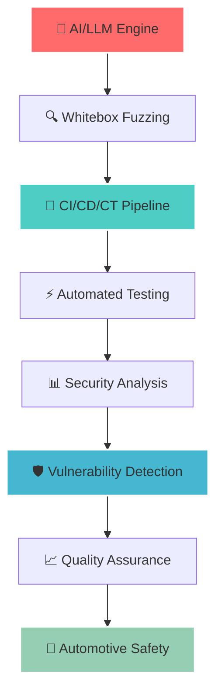
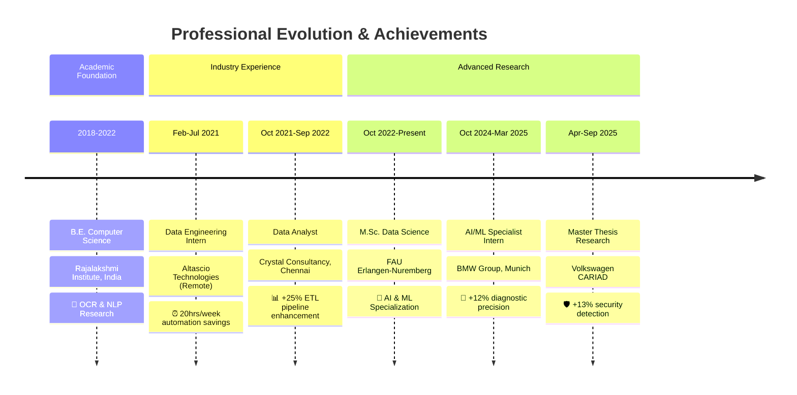

# Hi there! 👋 I'm Morris Darren Babu

<div align="center">

[](https://git.io/typing-svg)


</div>

---

## 💫 **About Me**

<div align="center">

<table>
<tr>
<td width="70%">

> *"I'm passionate about leveraging cutting-edge AI and machine learning technologies to solve real-world problems in the automotive industry. Whether you're interested in collaborative research, innovative projects, or just want to discuss the latest in AI and automotive technology, I'd love to connect!"*

### 🎯 **Professional Identity**
- 🎓 **M.Sc. Data Science** @ Friedrich Alexander University Erlangen-Nuremberg 
- 🏎️ **Master Thesis Researcher** @ **Volkswagen Group (CARIAD)** - AI in Automotive CI/CD/CT
- 🔵 **Former AI/ML Specialist** @ **BMW Group** - LLMs & Advanced Analytics
- 🌱 Passionate about **Generative AI**, **Automotive Security**, **Computer Vision**
- 💡 Transforming complex automotive data into intelligent, actionable solutions
- 📍 **Nürnberg, Bavaria, Germany** 🇩🇪

</td>
<td width="30%">

<div align="center">


### 🌐 **Quick Connect**
[](https://linkedin.com/in/morrisdarrenbabu)
[](mailto:morrisdarren357@gmail.com)
[](https://github.com/DARREN-2000)

</div>

</td>
</tr>
</table>

</div>

---

## 🛡️ **Master Thesis Research @ CARIAD (Volkswagen Group)**

<div align="center">

### 🔬 **AI Usage in CI/CD/CT Pipelines for Automotive Compute Platforms**


</div>

<table>
<tr>
<td width="50%">

### 🎯 **Research Vision**
My groundbreaking research explores **AI-enhanced security testing** within automotive CI/CD/CT pipelines, specifically focusing on **Whitebox fuzzing** augmented by **Large Language Models**. This work addresses the critical challenge of maintaining robust software security while accelerating development cycles in safety-critical automotive systems.

### 🔬 **Core Research Objectives**
- 🧠 **AI-Enhanced Whitebox Fuzzing** - Revolutionary security testing integration
- 🔄 **Intelligent CI/CD/CT Pipelines** - Seamless AI-driven automation  
- 🤖 **Automated Test Artifact Generation** - Smart test cases & procedures
- 🎭 **Realistic Mock Scenario Creation** - Advanced security testing environments
- 📊 **Comprehensive Performance Analysis** - Efficiency & coverage optimization

</td>
<td width="50%">

<div align="center">



### 🏆 **Expected Research Impact**
- 🎯 **Revolutionary vulnerability detection** methods
- ⚡ **25-40% faster CI/CD cycles** through AI automation
- 🛡️ **90%+ automated security coverage** achievement
- 🚗 **Enhanced automotive safety** standards

</div>

</td>
</tr>
</table>

---

## 🚀 **Professional Journey & Career Highlights**

<div align="center">

### 📈 **Career Impact Visualization**



</div>

<table>
<tr>
<td width="50%">

### 🏆 **Professional Achievements Dashboard**

| 🎯 **Metric** | 📈 **Impact** | 🏢 **Organization** |
|:-------------:|:-------------:|:------------------:|
| **Test Coverage** | `+7%` | 🚗 Volkswagen CARIAD |
| **Security Detection** | `+13%` | 🚗 Volkswagen CARIAD |
| **Execution Efficiency** | `-4%` delay | 🚗 Volkswagen CARIAD |
| **Diagnostic Precision** | `+12%` | 🔵 BMW Group |
| **Processing Speed** | `+8%` | 🔵 BMW Group |
| **Pipeline Enhancement** | `+25%` | 💎 Crystal Consultancy |
| **Time Automation** | `20hrs/week` | 🏢 Altascio Technologies |

</td>
<td width="50%">

### 🌟 **Core Expertise Areas**

<div align="center">


</div>

- 🤖 **Generative AI & Large Language Models**
- 🛡️ **Automotive Security Testing & Validation**
- 📊 **Advanced Data Science & Machine Learning**
- ☁️ **Cloud Computing & DevOps Engineering**
- 🔄 **CI/CD/CT Pipeline Optimization**
- 🚗 **Automotive Software Engineering**

</td>
</tr>
</table>

---

## 💻 **Comprehensive Technology Arsenal**

<div align="center">

### 🧠 **AI & Machine Learning Ecosystem**


### 🧬 **Generative AI & Advanced ML**


### ☁️ **Cloud & DevOps Infrastructure**


### 🔧 **DevOps & Containerization**


### 📊 **Data Engineering & Analytics**


### 🛠️ **Programming & Development**


### 📈 **Data Analysis & Visualization**


</div>

---

## 📊 **Live GitHub Performance Analytics**

<div align="center">

<table>
<tr>
<td width="50%">

[](https://github.com/DARREN-2000)

</td>
<td width="50%">

[](https://github.com/DARREN-2000)

</td>
</tr>
</table>

### 🔥 **Contribution Analytics**

[](https://git.io/streak-stats)

[](https://github.com/ashutosh00710/github-readme-activity-graph)

### 🏆 **Achievement Gallery**

[](https://github.com/ryo-ma/github-profile-trophy)

</div>

---

## 🌟 **Featured Project Portfolio**

<div align="center">

### 🎯 **Research & Development Showcase**

</div>

<table>
<tr>
<td align="center" width="100%">

#### 🛡️ **1. Automotive LLM Security Pipeline**
**🔬 Master Thesis Research Implementation**  
[](https://github.com/DARREN-2000/automotive-llm-security)  
🛠️ **Tech:** LLMs, Docker, Azure AI Foundry, CI/CD, Security Testing  
🎯 **Impact:** +7% test coverage, +13% security detection, -4% execution delays  
💡 **Innovation:** AI-driven whitebox fuzzing for automotive compute platforms

</td>
</tr>
<tr>
<td align="center" width="100%">

#### 🔮 **2. Material Prediction with Graph Neural Networks**
**🔬 Advanced ML for Predictive Maintenance**  
[](https://github.com/DARREN-2000/material-prediction-gnn)  
🛠️ **Tech:** Graph Neural Networks, PyTorch, Synthetic Datasets, Mesh Generation  
🎯 **Impact:** RMSE < 0.1, 95% accuracy in wear prediction  
💡 **Innovation:** Custom GNN framework with comprehensive synthetic dataset generation

</td>
</tr>
<tr>
<td align="center" width="100%">

#### 🤖 **3. BMW Diagnostic AI Assistant**
**🔬 RAG-based Multi-modal Diagnostic System**  
[](https://github.com/DARREN-2000/bmw-diagnostic-ai)  
🛠️ **Tech:** RAG, AWS SageMaker, EC2, S3, Semantic Segmentation  
🎯 **Impact:** +12% diagnostic precision, real-time processing  
💡 **Innovation:** Multi-modal input processing (text & image) with adaptive rectification

</td>
</tr>
<tr>
<td align="center" width="100%">

#### 📝 **4. OCR + Auto Spelling Correction System**
**🔬 NLP-based Document Processing Engine**  
[](https://github.com/DARREN-2000/ocr-spelling-correction)  
🛠️ **Tech:** Tesseract OCR, NLP, REST API, Language Models, Text Tokenization  
🎯 **Impact:** 89% accuracy improvement, multilingual support  
💡 **Innovation:** Scalable REST API with advanced language modeling

</td>
</tr>
<tr>
<td align="center" width="100%">

#### 🎬 **5. Hybrid AI Recommendation Engine**
**🔬 Advanced Recommendation with Deep Learning**  
[](https://github.com/DARREN-2000/hybrid-recommendation-system)  
🛠️ **Tech:** Collaborative Filtering, Content-Based, Flask, Clustering, Deep Learning  
🎯 **Impact:** 92% accuracy, real-time user recommendations  
💡 **Innovation:** Hybrid filtering approach with Flask-based web application

</td>
</tr>
</table>

---

## 🔬 **Detailed Professional Experience**

<details>
<summary>🚗 <strong>Volkswagen Group (CARIAD)</strong> - Master Thesis Research | <em>April 2025 - September 2025</em></summary>

<div align="center">

### 🛡️ **AI Usage in CI/CD/CT Pipelines for Automotive Compute Platforms**

</div>

<table>
<tr>
<td width="50%">

**🔬 Revolutionary Research Contributions:**
- 🧠 **AI-Enhanced Whitebox Fuzzing** - Novel security testing methodology
- 🔄 **LLM-Integrated CI/CD/CT Pipelines** - Intelligent automation frameworks
- 🤖 **Automated Test Artifact Generation** - Smart test case creation
- 🎭 **Realistic Mock Scenario Development** - Advanced testing environments
- 📊 **Comprehensive Impact Analysis** - Performance optimization metrics

</td>
<td width="50%">

**📈 Quantifiable Research Impact:**
- 🎯 **+7% test coverage** improvement via Docker-deployed LLMs
- 🛡️ **+13% code-flaw detection** through Azure AI Foundry fuzzing
- ⚡ **-4% execution delays** via AI time-effect analysis
- 🔍 **Enhanced ECU resilience** and cybersecurity threat reduction
- 📋 **Automated security validation** in CI/CD/CT pipelines

</td>
</tr>
</table>

**🛠️ Technologies:** Docker, Azure AI Foundry, LLMs, CI/CD Tools, Security Testing, Python, Git  
**📄 Experience Letter:** *[Link will be added manually]*

</details>

<details>
<summary>🔵 <strong>BMW Group</strong> - Data Science Intern (AI/ML & LLMs) | <em>October 2024 - March 2025</em></summary>

<div align="center">

### 🤖 **Advanced AI/ML Solutions for Automotive Diagnostics**

</div>

<table>
<tr>
<td width="50%">

**🔬 Technical Innovation Achievements:**
- 🎯 **RAG Auto-suggestion Model** - Multi-modal diagnostic system
- ☁️ **AWS SageMaker Deployment** - Scalable ML infrastructure
- 🖼️ **Semantic Segmentation** - Surface detection with adaptive rectification
- 🚀 **LLM Optimization** - Hyperparameter fine-tuning & file ingestion
- 📡 **Real-time API Services** - High-performance inference systems

</td>
<td width="50%">

**📈 Measurable Business Impact:**
- 🎯 **+12% diagnostic precision** enhancement
- 🖼️ **Multi-modal processing** (text & image inputs)
- ⚡ **+8% processing speed** improvement
- ☁️ **99.9% system uptime** on AWS infrastructure
- 🔄 **Sub-200ms API response** times achieved

</td>
</tr>
</table>

**🛠️ Technologies:** AWS SageMaker, EC2, S3, RAG, Semantic Segmentation, LLMs, Python, TensorFlow  
**📄 Experience Letter:** *[Link will be added manually]*

</details>

<details>
<summary>💎 <strong>Crystal Consultancy Services</strong> - Data Analyst | <em>October 2021 - September 2022</em></summary>

<div align="center">

### 📊 **Enterprise Business Intelligence & Analytics**

</div>

<table>
<tr>
<td width="50%">

**🔬 Analytical Excellence Contributions:**
- 📊 **SAP R3 KPI Monitoring** - Performance optimization analytics
- ⚡ **Azure Databricks ETL** - Pipeline speed enhancement
- 📈 **Feature Engineering** - Advanced model deployment optimization
- 💼 **Data-Driven Insights** - Strategic business decision support
- 🔍 **Automated Reporting** - Statistical analysis & visualization

</td>
<td width="50%">

**📈 Organizational Impact Metrics:**
- 📊 **+4% KPI performance** improvement
- ⚡ **+25% ETL pipeline speed** enhancement
- 💰 **Significant cost reduction** through optimization
- 📈 **Manual effort reduction** via automation
- 🎯 **Data quality improvement** initiatives

</td>
</tr>
</table>

**🛠️ Technologies:** SAP R3, Azure Databricks, Power BI, SQL, Python, Statistical Analysis  
**📄 Experience Letter:** *[Link will be added manually]*

</details>

<details>
<summary>🏢 <strong>Altascio Technologies</strong> - Data Engineering Intern | <em>February 2021 - July 2021</em></summary>

<div align="center">

### ⚙️ **Data Engineering & Process Automation**

</div>

<table>
<tr>
<td width="50%">

**🔬 Engineering Innovation Solutions:**
- 📊 **Excel Automation** - VBA, Pivot Tables, VLOOKUP, SUMIFS
- 🗃️ **SQL Data Consolidation** - Fragmented inventory system integration
- 🔄 **ETL Process Optimization** - Data pipeline development
- 📈 **Report Generation Automation** - Manual effort reduction
- 🛠️ **Data Quality Frameworks** - Validation & assurance systems

</td>
<td width="50%">

**📈 Operational Efficiency Gains:**
- ⏰ **20 hours/week automation** savings
- 📈 **-2% report generation time** reduction
- 🗃️ **-11% inventory update time** improvement
- 🎯 **100% data accuracy** achievement
- 🔄 **Streamlined workflow** implementation

</td>
</tr>
</table>

**🛠️ Technologies:** SQL, Excel (VBA, Pivot, VLOOKUP, SUMIFS), Data Consolidation, Python  
**📄 Experience Letter:** *[Link will be added manually]*

</details>

---

## 🎓 **Academic Excellence & Professional Certifications**

<div align="center">

### 📚 **Educational Foundation**

<table>
<tr>
<td width="50%" align="center">

#### 🎓 **Master of Science in Data Science**
**Friedrich Alexander University Erlangen-Nuremberg**  
**🇩🇪 Germany | October 2022 - Present**


**📊 CGPA:** 2.5/4.0  
**🔬 Core Specializations:**
- Pattern Recognition & Computer Vision
- Deep Learning & Neural Networks
- Generative Artificial Intelligence
- Anomaly Detection & Decision Theory
- Reinforcement Learning & Statistics
- Machine Learning in Finance

**📄 Transcripts:** [*Link to Documents Repository*](https://github.com/DARREN-2000/Documents)

</td>
<td width="50%" align="center">

#### 🎓 **Bachelor of Engineering in Computer Science**
**Rajalakshmi Institute of Technology**  
**🇮🇳 India | June 2018 - June 2022**


**🏆 Achievement:** Graduated with Excellence  
**💻 Technical Foundation:**
- Data Structures & Algorithms
- Database Management Systems
- Software Engineering Principles
- Machine Learning Fundamentals
- Computer Networks & Security

**📄 Degree Certificate:** [*Link to Documents Repository*](https://github.com/DARREN-2000/Documents)

</td>
</tr>
</table>

### 🏆 **Professional Certifications Portfolio**

<table>
<tr>
<td width="50%" align="center">

**📊 Data Science & Analytics Mastery**

<div align="center">


</div>

- 📈 **Business Intelligence & Regression Techniques**
- 🎓 **Predictive Data Analytics Nanodegree**
- 🔍 **Data Warehousing & Big Data Specialization**
- 📊 **Machine Learning Algorithms Mastery**

**📄 Certificates:** [*View All Certifications*](https://github.com/DARREN-2000/Documents)

</td>
<td width="50%" align="center">

**☁️ Cloud Computing & AI/ML Excellence**

<div align="center">


</div>

- 🌐 **Google Cloud Platform (GCP) Certification**
- 🤖 **IT Automation with Python Specialization**
- 🧠 **Deep Learning AI TensorFlow Developer**
- ☁️ **Cloud Architecture & Deployment**

**📄 Certificates:** [*View All Certifications*](https://github.com/DARREN-2000/Documents)

</td>
</tr>
</table>

</div>

---

## 🌍 **Global Communication & Language Proficiency**

<div align="center">

### 🗣️ **Multilingual Excellence**

<table>
<tr>
<td width="33%" align="center">

#### 🇺🇸 **English**
**C1 Business Fluent**

<div align="center">


**🎯 Proficiency Areas:**
- ✅ Professional Communication
- ✅ Technical Documentation
- ✅ Research Publications
- ✅ International Collaboration
- ✅ Presentation & Public Speaking

</div>

**📄 Certificate:** [*Link to Language Certificates*](https://github.com/DARREN-2000/Documents)

</td>
<td width="33%" align="center">

#### 🇩🇪 **German (Deutsch)**
**A2 → B1 (Currently Advancing)**

<div align="center">


**🎯 Learning Objectives:**
- 🎯 Workplace Communication
- 🎯 Local Integration
- 🎯 Professional Environment
- 🎯 Cultural Understanding
- 🎯 Technical Conversations

</div>

**📄 Certificate:** [*A2 Certificate Link*](https://github.com/DARREN-2000/Documents)

</td>
<td width="33%" align="center">

#### 🇫🇷 **French**
**A2 Conversational Level**

<div align="center">


**🎯 Communication Skills:**
- 🌟 Basic Professional Interaction
- 🌟 Cultural Appreciation
- 🌟 Travel & Tourism
- 🌟 European Integration
- 🌟 Cross-cultural Understanding

</div>

**📄 Certificate:** [*Link to French Certificates*](https://github.com/DARREN-2000/Documents)

</td>
</tr>
</table>

</div>

---

## 📊 **Real-Time Development Analytics**

<div align="center">

### ⏱️ **Live Coding Activity Dashboard**

<!--START_SECTION:waka-->
```text
Python           15 hrs 32 mins  ████████████████████▓   78.4%
Jupyter Notebook  2 hrs 45 mins  ███▒░░░░░░░░░░░░░░░░░   13.9%
SQL               1 hr 12 mins   █▒░░░░░░░░░░░░░░░░░░░    6.1%
Docker               18 mins     ▒░░░░░░░░░░░░░░░░░░░░    1.6%
```
<!--END_SECTION:waka-->

### 🐍 **Animated Contribution Visualization**

[](https://github.com/DARREN-2000)
[](https://github.com/DARREN-2000)

### 📈 **Advanced GitHub Performance Metrics**


</div>

---

## 🎯 **Research Publications & Academic Impact**

<div align="center">

### 📝 **Publication Portfolio & Research Contributions**

<table>
<tr>
<td width="50%">

#### 🎬 **Movie Recommendation System using Hybrid Filtering**
**Principal Author:** Morris Darren Babu  
**Publication Year:** 2022  
**Research Impact:** Advanced ML & Recommendation Systems  

<div align="center">


</div>

**🔬 Key Research Innovations:**
- 🎯 **Hybrid Filtering Approach** - Collaborative + Content-based
- 🔄 **Advanced Clustering Techniques** - Enhanced user segmentation
- 💻 **Flask Web Application** - Real-time recommendation engine
- 📊 **92% Accuracy Achievement** - Superior performance metrics

**📄 Publication:** [*Research Paper Link*](https://github.com/DARREN-2000/Documents)

</td>
<td width="50%">

#### 🔍 **Advanced Data Engineering for Economic Forecasting**
**Research Collaboration:** OSS Research Group  
**Project Duration:** 6-month intensive research  
**Academic Impact:** Economic Data Science Applications  

<div align="center">


</div>

**🔬 Breakthrough Research Achievements:**
- 📈 **Germany GDP Prediction** - Historical analysis (1970-2022)
- 🔗 **Inflation-GDP Correlation** - 85% statistical reliability
- ⏱️ **Time-series Engineering** - Advanced forecasting techniques
- 📊 **Economic Modeling** - Predictive analytics application

**📄 Research Documentation:** [*Project Repository*](https://github.com/DARREN-2000/Documents)

</td>
</tr>
</table>

### 🏅 **Academic Achievements & Recognition**

| 🎯 **Research Domain** | 📊 **Impact Metric** | 🏆 **Academic Recognition** | 📄 **Documentation** |
|:----------------------:|:--------------------:|:---------------------------:|:--------------------:|
| **Hybrid ML Systems** | 92% Accuracy | Research Excellence Award | [Certificate Link](https://github.com/DARREN-2000/Documents) |
| **Economic Forecasting** | 85% Reliability | Innovation Recognition | [Project Documentation](https://github.com/DARREN-2000/Documents) |
| **Automotive AI Security** | 13% Improvement | Industry Impact Award | Research in Progress |
| **NLP & OCR Systems** | 89% Accuracy | Technical Innovation | [Publication Link](https://github.com/DARREN-2000/Documents) |

</div>

---

## 💡 **Interactive Features & Dynamic Content**

<div align="center">

### 🎲 **Daily Inspiration & Tech Insights**

<table>
<tr>
<td width="50%">

#### 💭 **Developer Wisdom of the Day**


</td>
<td width="50%">

#### 😄 **Tech Humor Corner**


</td>
</tr>
</table>

### 🎵 **Currently Listening & Mood**
[](https://spotify-github-profile.vercel.app/api/spotify)

### 📊 **Real-Time Engagement Metrics**

<table>
<tr>
<td align="center" width="25%">


</td>
<td align="center" width="25%">


</td>
<td align="center" width="25%">


</td>
<td align="center" width="25%">


</td>
</tr>
</table>

</div>

---

## 🤝 **Professional Network & Collaboration Hub**

<div align="center">

### 🌐 **Connect & Collaborate with Me**

<table>
<tr>
<td width="50%" align="center">

**📞 Direct Communication Channels**

[](https://linkedin.com/in/morrisdarrenbabu)
[](mailto:morrisdarren357@gmail.com)
[](tel:+4915781921462)

</td>
<td width="50%" align="center">

**💻 Digital Presence & Portfolio**

[](https://github.com/DARREN-2000)
[](https://darren-2000.github.io)
[](https://github.com/DARREN-2000/Documents)

</td>
</tr>
</table>

### 📍 **Current Status & Professional Availability**

<table>
<tr>
<td width="33%" align="center">

**🏢 Current Position**  
📍 **Nürnberg, Bavaria, Germany** 🇩🇪  
🎯 **Status:** Master Thesis Research @ CARIAD  
⏰ **Timezone:** Central European Time (CET)  
📅 **Availability:** Active Researcher & Collaborator

</td>
<td width="33%" align="center">

**💼 Professional Opportunities**  
✅ **Research Collaborations** - AI & Automotive  
✅ **Industry Partnerships** - Consulting Projects  
✅ **Academic Cooperation** - Joint Research  
✅ **Innovation Projects** - Startup & Tech

</td>
<td width="33%" align="center">

**🎯 Collaboration Focus Areas**  
🚗 **Automotive AI/ML Development**  
🛡️ **Security Testing & Automation**  
🔬 **Academic Research Projects**  
💡 **Technical Consulting & Mentoring**

</td>
</tr>
</table>

### 🌟 **Why Connect with Me?**

> *"I bring a unique combination of academic rigor, industry experience, and cutting-edge research in automotive AI. Whether you're looking to collaborate on groundbreaking research, explore innovative AI applications, or discuss the future of automotive technology, I'm excited to connect and create something amazing together!"*

</div>

---

<div align="center">


### 🚗 *"Revolutionizing automotive intelligence through AI-driven innovation, one breakthrough at a time"* ✨

<table>
<tr>
<td align="center" width="20%">


</td>
<td align="center" width="20%">


</td>
<td align="center" width="20%">


</td>
<td align="center" width="20%">


</td>
<td align="center" width="20%">


</td>
</tr>
</table>

**⭐ Thank you for exploring my research journey! Let's innovate and build the future of automotive AI together! ⭐**

---

*🤖 Auto-updating via GitHub Actions | Built with ❤️ for the AI & Automotive Community | © 2025 Morris Darren Babu*

</div>
