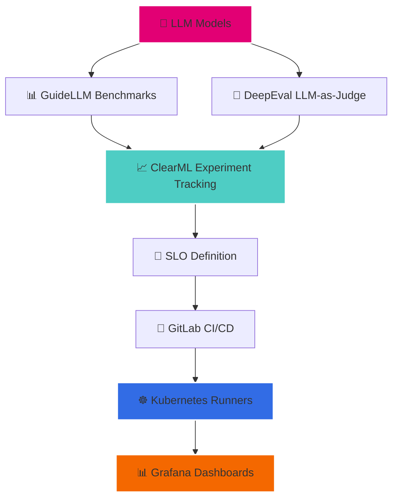
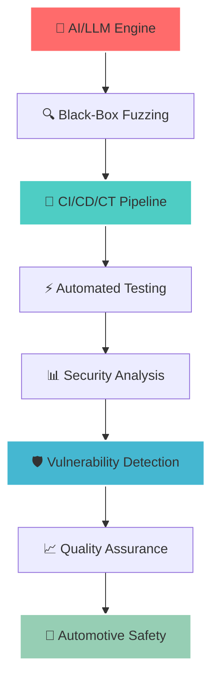
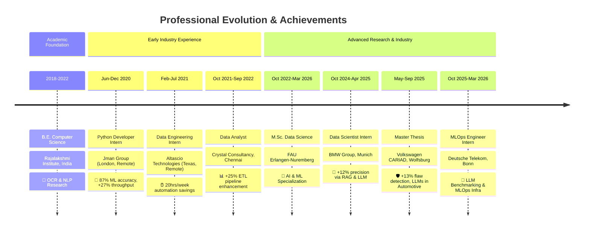

# Hi there! 👋 I'm Morris Darren Babu

<div align="center">

[](https://git.io/typing-svg)


</div>

---

## 💫 **About Me**

<div align="center">

<table>
<tr>
<td width="70%">

> *"Structured AI/Data Specialist skilled at transforming and automating data workflows. Proficient in AWS, Azure, and Docker for secure cloud-native DevOps. Expert in analytics, ML/DL, and interactive visualization for data-driven decisions. Experienced in GenAI, AI Agents and LLMOps, including LLM evaluation, prompt engineering, RAG, and LoRA/QLoRA fine-tuning. Drives innovation through agile collaboration and Industry 4.0 frameworks."*

### 🎯 **Professional Identity**
- 🏢 **MLOps Engineer Intern** @ **Deutsche Telekom** - LLM Infrastructure & Deployment
- 🏎️ **Master Thesis** @ **Volkswagen Group (CARIAD)** - Integrating LLMs In Automotive Systems
- 🔵 **Former Data Scientist Intern** @ **BMW Group** - RAG & LLM Systems
- 🎓 **M.Sc. Data Science** @ Friedrich Alexander University Erlangen-Nuremberg
- 🌱 Passionate about **GenAI**, **LLMOps**, **MLOps**, **Computer Vision**
- 💡 Transforming complex data into intelligent, actionable solutions
- 📍 **Bonn, NRW, Germany** 🇩🇪

</td>
<td width="30%">

<div align="center">


### 🌐 **Quick Connect**
[](https://linkedin.com/in/morrisdarrenbabu)
[](mailto:morrisdarren357@gmail.com)
[](https://github.com/DARREN-2000)
[](https://darren-2000.github.io/)

</div>

</td>
</tr>
</table>

</div>

---

## 🏢 **Current Role: Deutsche Telekom — MLOps Engineer Intern**

<div align="center">

### 🔬 **LLM Infrastructure & Deployment**


</div>

<table>
<tr>
<td width="50%">

### 🎯 **Key Contributions**
- 🧠 **LLM Benchmarking Framework** — Microservices on vLLM using GuideLLM (latency, throughput) and DeepEval (LLM-as-judge), tracking experiments in ClearML for SLOs
- 🔄 **Scaled Automated Benchmarking** — GitLab CI/CD & Kubernetes runners, containerized matrix jobs on Hugging Face datasets, reports published to Grafana
- 🔐 **Secured Enterprise MLflow** — Kubernetes deployments with Keycloak OIDC & OAuth sidecars for SSO, ingress, TLS, and RBAC compliance

</td>
<td width="50%">

<div align="center">


```mermaid
graph TD
    A[🧠 LLM Models] --> B[📊 GuideLLM Benchmarks]
    A --> C[🤖 DeepEval LLM-as-Judge]
    B --> D[📈 ClearML Experiment Tracking]
    C --> D
    D --> E[🎯 SLO Definition]
    E --> F[🔄 GitLab CI/CD]
    F --> G[☸️ Kubernetes Runners]
    G --> H[📊 Grafana Dashboards]

    style A fill:#E20074,stroke:#fff,stroke-width:2px
    style D fill:#4ECDC4,stroke:#fff,stroke-width:2px
    style G fill:#326CE5,stroke:#fff,stroke-width:2px
    style H fill:#F46800,stroke:#fff,stroke-width:2px
```

### 🏆 **Technologies**
vLLM · GuideLLM · DeepEval · ClearML · MLflow · Keycloak · Kubernetes (Helm) · GitLab CI/CD · Grafana · Docker

</div>

</td>
</tr>
</table>

---

## 🛡️ **Master Thesis @ CARIAD (Volkswagen Group)**

<div align="center">

### 🔬 **Integrating LLMs In Automotive Systems**


</div>

<table>
<tr>
<td width="50%">

### 🎯 **Research Vision**
My research explores **AI-driven black-box fuzzing** within automotive CI/CD/CT pipelines, leveraging **Large Language Models** in **Azure AI Foundry**. This work addresses the critical challenge of maintaining robust software security while accelerating development cycles in safety-critical automotive systems.

### 🔬 **Core Research Contributions**
- 🧠 **AI-Driven Black-Box Fuzzing** — Benchmarked 16 LLM models, boosting code-flaw detection by 13%
- 🔄 **Automated Test-Case Generation** — Containerized LLM inference in CI/CD/CT, cutting test creation time by 33%
- 🔐 **Secure Azure Private Link** — Automated LLM fuzz-testing PoC, reducing delays by 10%

</td>
<td width="50%">

<div align="center">


```mermaid
graph TD
    A[🧠 AI/LLM Engine] --> B[🔍 Black-Box Fuzzing]
    B --> C[🔄 CI/CD/CT Pipeline]
    C --> D[⚡ Automated Testing]
    D --> E[📊 Security Analysis]
    E --> F[🛡️ Vulnerability Detection]
    F --> G[📈 Quality Assurance]
    G --> H[🚗 Automotive Safety]

    style A fill:#FF6B6B,stroke:#fff,stroke-width:2px
    style C fill:#4ECDC4,stroke:#fff,stroke-width:2px
    style F fill:#45B7D1,stroke:#fff,stroke-width:2px
    style H fill:#96CEB4,stroke:#fff,stroke-width:2px
```

### 🏆 **Quantifiable Impact**
- 🎯 **+13% code-flaw detection** via Azure AI Foundry
- ⚡ **-33% test creation time** through automation
- 🛡️ **+7% code coverage** increase
- 🚗 **-10% execution delays** — improved SW quality

</div>

</td>
</tr>
</table>

---

## 🚀 **Professional Journey & Career Highlights**

<div align="center">

### 📈 **Career Impact Visualization**


```mermaid
timeline
    title Professional Evolution & Achievements

    section Academic Foundation
        2018-2022    : B.E. Computer Science
                     : Rajalakshmi Institute, India
                     : 📝 OCR & NLP Research

    section Early Industry Experience
        Jun-Dec 2020 : Python Developer Intern
                     : Jman Group (London, Remote)
                     : 🤖 87% ML accuracy, +27% throughput
        Feb-Jul 2021 : Data Engineering Intern
                     : Altascio Technologies (Texas, Remote)
                     : ⏰ 20hrs/week automation savings
        Oct 2021-Sep 2022 : Data Analyst
                           : Crystal Consultancy, Chennai
                           : 📊 +25% ETL pipeline enhancement

    section Advanced Research & Industry
        Oct 2022-Mar 2026 : M.Sc. Data Science
                          : FAU Erlangen-Nuremberg
                          : 🧠 AI & ML Specialization
        Oct 2024-Apr 2025 : Data Scientist Intern
                          : BMW Group, Munich
                          : 🎯 +12% precision via RAG & LLM
        May-Sep 2025      : Master Thesis
                          : Volkswagen CARIAD, Wolfsburg
                          : 🛡️ +13% flaw detection, LLMs in Automotive
        Oct 2025-Mar 2026 : MLOps Engineer Intern
                          : Deutsche Telekom, Bonn
                          : 🚀 LLM Benchmarking & MLOps Infra
```

</div>

<table>
<tr>
<td width="50%">

### 🏆 **Professional Achievements Dashboard**

| 🎯 **Metric** | 📈 **Impact** | 🏢 **Organization** |
|:-------------:|:-------------:|:------------------:|
| **LLM Benchmarking** | SLO-driven | 🏢 Deutsche Telekom |
| **Enterprise MLflow** | Keycloak SSO | 🏢 Deutsche Telekom |
| **Code-Flaw Detection** | `+13%` | 🚗 Volkswagen CARIAD |
| **Test Creation Time** | `-33%` | 🚗 Volkswagen CARIAD |
| **Code Coverage** | `+7%` | 🚗 Volkswagen CARIAD |
| **Diagnostic Precision** | `+12%` | 🔵 BMW Group |
| **Processing Speed** | `+8%` | 🔵 BMW Group |
| **Pipeline Enhancement** | `+25%` | 💎 Crystal Consultancy |
| **ML Accuracy** | `87%` | 🟢 Jman Group |
| **ETL Throughput** | `+27%` | 🟢 Jman Group |
| **Time Automation** | `20hrs/week` | 🏢 Altascio Technologies |

</td>
<td width="50%">

### 🌟 **Core Expertise Areas**

<div align="center">


</div>

- 🤖 **GenAI, LLMOps & AI Agents**
- 📊 **ML/DL & Interactive Visualization**
- ☁️ **AWS, Azure & Cloud-Native DevOps**
- 🔄 **CI/CD/CT Pipeline Optimization**
- 🛡️ **Security Testing & MLOps**
- 🏭 **Industry 4.0 Frameworks**

</td>
</tr>
</table>

---

## 💻 **Comprehensive Technology Arsenal**

<div align="center">

### 🧠 **AI & Machine Learning Ecosystem**


### 🧬 **Generative AI & LLMOps**


### ☁️ **Cloud & DevOps Infrastructure**


### 🔧 **DevOps, MLOps & Containerization**


### 📊 **Data Engineering & Analytics**


### 🛠️ **Programming & Development**


### 📈 **Data Analysis & Visualization**


</div>

---

## 📊 **Live GitHub Performance Analytics**

<div align="center">

<table>
<tr>
<td width="50%">

[](https://github.com/DARREN-2000)

</td>
<td width="50%">

[](https://github.com/DARREN-2000)

</td>
</tr>
</table>

### 🔥 **Contribution Analytics**

[](https://git.io/streak-stats)

[](https://github.com/ashutosh00710/github-readme-activity-graph)

### 🏆 **Achievement Gallery**

[](https://github.com/ryo-ma/github-profile-trophy)

</div>

---

## 🌟 **Featured Project Portfolio**

<div align="center">

### 🎯 **Research & Development Showcase**

</div>

<table>
<tr>
<td align="center" width="100%">

#### 🛡️ **1. LLM Integration for Automotive Systems**
**🔬 Master Thesis — Volkswagen Group (CARIAD)**
[](https://github.com/DARREN-2000/llm-integration)
🛠️ **Tech:** LLMs, Docker, Azure AI Foundry, CI/CD/CT, Black-Box Fuzzing
🎯 **Impact:** +13% code-flaw detection, -33% test creation time, +7% code coverage
💡 **Innovation:** AI-driven black-box fuzzing for automotive compute platforms

</td>
</tr>
<tr>
<td align="center" width="100%">

#### 🔮 **2. Material Prediction & Mesh Dataset Generation with GNNs**
**🔬 Advanced ML for Predictive Maintenance**
[](https://github.com/DARREN-2000/Graph-Neural-Networks)
[](https://github.com/DARREN-2000/GNN-Dataset-Generation-for-Material-Wear-Prediction)
🛠️ **Tech:** Graph Neural Networks, PyTorch, Synthetic Datasets, Mesh Generation
🎯 **Impact:** RMSE < 0.1, custom GNN framework for structural wear prediction
💡 **Innovation:** Synthetic mesh dataset generation for material wear prediction

</td>
</tr>
<tr>
<td align="center" width="100%">

#### 📝 **3. OCR with Handwritten Recognition & Auto Spelling Correction**
**🔬 Bachelor Thesis — NLP-based Document Processing**
[](https://github.com/DARREN-2000/OCR-with-Handwritten-Recognition-and-Auto-Spelling-Correction)
🛠️ **Tech:** Tesseract OCR, NLP, Language Models, Text Tokenization
🎯 **Impact:** 89% CER reduction, automated spelling correction
💡 **Innovation:** End-to-end OCR pipeline with handwritten recognition

</td>
</tr>
<tr>
<td align="center" width="100%">

#### 🎬 **4. Hybrid Movie Recommendation System**
**🔬 Publication — Advanced Recommendation with Deep Learning**
[](https://github.com/DARREN-2000/Hybrid-Movie-Recommendation-System)
🛠️ **Tech:** Collaborative Filtering, Content-Based, Flask, Clustering, Deep Learning
🎯 **Impact:** 92% Top-K Hit Rate, real-time user recommendations
💡 **Innovation:** Hybrid filtering approach combining collaborative and content-based methods

</td>
</tr>
</table>

---

## 📂 **GitHub Repositories**

<div align="center">

### 🗂️ **All Public Repositories**

<table>
<tr>
<td width="50%">

[](https://github.com/DARREN-2000/Graph-Neural-Networks)

</td>
<td width="50%">

[](https://github.com/DARREN-2000/GNN-Dataset-Generation-for-Material-Wear-Prediction)

</td>
</tr>
<tr>
<td width="50%">

[](https://github.com/DARREN-2000/OCR-with-Handwritten-Recognition-and-Auto-Spelling-Correction)

</td>
<td width="50%">

[](https://github.com/DARREN-2000/Hybrid-Movie-Recommendation-System)

</td>
</tr>
<tr>
<td width="50%">

[](https://github.com/DARREN-2000/llm-integration)

</td>
<td width="50%">

[](https://github.com/DARREN-2000/B2B_Consent_Personalization)

</td>
</tr>
<tr>
<td width="50%">

[](https://github.com/DARREN-2000/Classify-Math-Publications)

</td>
<td width="50%">

[](https://github.com/DARREN-2000/AI-Assignments)

</td>
</tr>
<tr>
<td width="50%">

[](https://github.com/DARREN-2000/Machine-Learning-Hands-on)

</td>
<td width="50%">

[](https://github.com/DARREN-2000/Data-Preprocessing-Templates)

</td>
</tr>
<tr>
<td width="50%">

[](https://github.com/DARREN-2000/Cloud-Native-Cassandra-Building-CRUD-applications-with-Python-and-NodeJS)

</td>
<td width="50%">

[](https://github.com/DARREN-2000/DARREN-2000.github.io)

</td>
</tr>
</table>

</div>

---

## 🔬 **Detailed Professional Experience**

<details>
<summary>🏢 <strong>Deutsche Telekom</strong> — MLOps Engineer Intern | LLM Infrastructure & Deployment | <em>October 2025 – March 2026, Bonn</em></summary>

<div align="center">

### 🚀 **LLM Benchmarking & Enterprise MLOps**

</div>

<table>
<tr>
<td width="50%">

**🔬 Key Engineering Contributions:**
- 🧠 **LLM Benchmarking Framework** — Microservices on vLLM with GuideLLM & DeepEval
- 📈 **ClearML Experiment Tracking** — SLO definition for model selection & capacity planning
- 🔄 **Automated CI/CD Benchmarking** — GitLab CI/CD, Kubernetes runners, Hugging Face datasets
- 📊 **Grafana Reporting** — Published containerized matrix job results
- 🔐 **Enterprise MLflow Security** — Keycloak OIDC, OAuth sidecars, TLS, RBAC

</td>
<td width="50%">

**📈 Impact & Outcomes:**
- 🎯 **SLO-driven model selection** & capacity planning
- ☸️ **Kubernetes-native** benchmarking at scale
- 🔐 **SSO & compliance** for enterprise MLflow
- 📊 **Real-time dashboards** via Grafana
- 🔄 **Fully automated** end-to-end pipeline

</td>
</tr>
</table>

**🛠️ Technologies:** vLLM, GuideLLM, DeepEval, ClearML, MLflow, Keycloak, Kubernetes, Helm, GitLab CI/CD, Grafana, Docker

</details>

<details>
<summary>🚗 <strong>Volkswagen Group (CARIAD)</strong> — Master Thesis | Integrating LLMs In Automotive Systems | <em>May 2025 – September 2025, Wolfsburg</em></summary>

<div align="center">

### 🛡️ **AI-Driven Black-Box Fuzzing for Automotive Cybersecurity**

</div>

<table>
<tr>
<td width="50%">

**🔬 Research Contributions:**
- 🧠 **AI-Driven Black-Box Fuzzing** — Benchmarked 16 LLM models in Azure AI Foundry
- 🔄 **Automated Test-Case Generation** — Containerized LLM inference in CI/CD/CT pipelines
- 🔐 **Secure Azure Private Link** — Automated LLM fuzz-testing PoC replacing manual tests
- 🚗 **ECU Resilience** — Strengthened automotive cybersecurity posture
- 📊 **Comprehensive Evaluation** — Performance & coverage optimization

</td>
<td width="50%">

**📈 Quantifiable Research Impact:**
- 🎯 **+13% code-flaw detection** through Azure AI Foundry fuzzing
- ⚡ **-33% test creation time** via automated generation
- 🛡️ **+7% code coverage** improvement via Docker-deployed LLMs
- 🔍 **-10% execution delays** via Azure Private Link
- 📋 **Reduced OEM cybersecurity threats**

</td>
</tr>
</table>

**🛠️ Technologies:** Azure AI Foundry, Azure Private Link, Docker, LLMs, CI/CD/CT, Python, Git

</details>

<details>
<summary>🔵 <strong>BMW Group</strong> — Data Scientist Intern | RAG & LLM Systems | <em>October 2024 – April 2025, Munich</em></summary>

<div align="center">

### 🤖 **RAG & LLM Systems for Automotive Diagnostics**

</div>

<table>
<tr>
<td width="50%">

**🔬 Technical Innovation Achievements:**
- 🎯 **CRNN Surface Detection** — Deployed on AWS SageMaker (EC2, S3) with semantic segmentation
- 🌐 **Django Web Application** — Parsing geometric STL meshes & file ingestion
- 🤖 **LLM Auto-Suggestion Model** — RAG & vector search for part issue identification
- 📡 **Document Chunking Pipelines** — Data indexing for precision enhancement
- ☁️ **API-Served Results** — Cut false positives via tuned AI parameters

</td>
<td width="50%">

**📈 Measurable Business Impact:**
- 🎯 **+12% precision** via RAG & vector search
- ⚡ **+8% faster processing** through document chunking
- ☁️ **AWS SageMaker** production deployment
- 🖼️ **Semantic segmentation** for surface detection
- 🔄 **Django-based** mesh parsing application

</td>
</tr>
</table>

**🛠️ Technologies:** AWS SageMaker, EC2, S3, RAG, Django, Semantic Segmentation, LLMs, Python, TensorFlow

</details>

<details>
<summary>💎 <strong>Crystal Consultancy Services</strong> — Data Analyst | <em>October 2021 – September 2022, Chennai, India</em></summary>

<div align="center">

### 📊 **Enterprise Business Intelligence & Analytics**

</div>

<table>
<tr>
<td width="50%">

**🔬 Analytical Contributions:**
- 📊 **SAP R3 KPI Monitoring** — Data-driven performance optimization
- ⚡ **Azure Databricks ETL** — Pipeline speed enhancement
- 📈 **Feature Engineering** — Model deployment optimization
- 💼 **Data-Driven Decisions** — Targeted business impact

</td>
<td width="50%">

**📈 Organizational Impact Metrics:**
- 📊 **+4% KPI improvement** through targeted decisions
- ⚡ **+25% ETL pipeline speed** via Azure Databricks
- 📈 **Optimized feature engineering** & model deployment
- 🎯 **Data quality improvement** initiatives

</td>
</tr>
</table>

**🛠️ Technologies:** SAP R3, Azure Databricks, Power BI, SQL, Python, Statistical Analysis

</details>

<details>
<summary>🏢 <strong>Altascio Technologies</strong> — Data Engineering Intern | <em>February 2021 – July 2021, Texas, USA (Remote)</em></summary>

<div align="center">

### ⚙️ **Data Engineering & Process Automation**

</div>

<table>
<tr>
<td width="50%">

**🔬 Engineering Solutions:**
- 📊 **Excel Automation** — VBA, Pivot Tables, VLOOKUP, SUMIFS
- 🗃️ **SQL Data Consolidation** — Fragmented inventory integration
- 🔄 **ETL Process Optimization** — Data pipeline development
- 📈 **Report Generation Automation** — Manual effort reduction

</td>
<td width="50%">

**📈 Operational Efficiency Gains:**
- ⏰ **20 hours/week** automation savings
- 📈 **-2% report generation time** reduction
- 🗃️ **-11% inventory update time** improvement
- 🔄 **Streamlined workflows**

</td>
</tr>
</table>

**🛠️ Technologies:** SQL, Excel (VBA, Pivot, VLOOKUP, SUMIFS), Data Consolidation, Python

</details>

<details>
<summary>🟢 <strong>Jman Group</strong> — Python Developer Intern | <em>June 2020 – December 2020, London, UK (Remote)</em></summary>

<div align="center">

### 🤖 **Predictive Modeling & Data Science**

</div>

<table>
<tr>
<td width="50%">

**🔬 Technical Contributions:**
- 🤖 **Predictive Models** — ML algorithms using sensor data
- 📡 **Field Testing** — 87% accuracy in real-world tests
- 🔄 **End-to-End Data Science** — Solved ETL pipeline bottlenecks
- 📈 **Throughput Optimization** — Pipeline performance enhancement

</td>
<td width="50%">

**📈 Measurable Impact:**
- 🎯 **87% accuracy** in field tests
- ⚡ **+27% throughput** improvement
- 🔄 **ETL bottleneck resolution**
- 📊 **End-to-end** pipeline delivery

</td>
</tr>
</table>

**🛠️ Technologies:** Python, ML Algorithms, Sensor Data Processing, ETL Pipelines

</details>

---

## 🎓 **Academic Excellence & Professional Certifications**

<div align="center">

### 📚 **Educational Foundation**

<table>
<tr>
<td width="50%" align="center">

#### 🎓 **Master of Science in Data Science**
**Friedrich Alexander University Erlangen-Nuremberg**
**🇩🇪 Germany | October 2022 – March 2026**


**🔬 Core Specializations:**
- Pattern Recognition & Computer Vision
- Deep Learning & Neural Networks
- Generative Artificial Intelligence
- Anomaly Detection & Decision Theory
- Reinforcement Learning & Statistics
- Machine Learning in Finance

**📄 Transcripts:** [*Link to Documents Repository*](https://github.com/DARREN-2000/Documents)

</td>
<td width="50%" align="center">

#### 🎓 **Bachelor of Engineering in Computer Science**
**Rajalakshmi Institute of Technology**
**🇮🇳 India | June 2018 – June 2022**


**🏆 Achievement:** Graduated with Excellence
**💻 Technical Foundation:**
- Data Structures & Algorithms
- Database Management Systems
- Software Engineering Principles
- Machine Learning Fundamentals
- Computer Networks & Security

**📄 Degree Certificate:** [*Link to Documents Repository*](https://github.com/DARREN-2000/Documents)

</td>
</tr>
</table>

### 🏆 **Professional Certifications Portfolio**

<table>
<tr>
<td width="50%" align="center">

**📊 Data Science & Analytics Mastery**

<div align="center">


</div>

- 📈 **Excel to MySQL: Regression Statistics**
- 🎓 **Predictive Data Analytics for BI Nanodegree**
- 🔍 **Data Warehousing, Big Data on GCP**

**📄 Certificates:** [*View All Certifications*](https://github.com/DARREN-2000/Documents)

</td>
<td width="50%" align="center">

**☁️ Cloud Computing & AI/ML Excellence**

<div align="center">


</div>

- 🌐 **Google Cloud Platform IT Automation**
- 🧠 **DL AI TensorFlow Developer**
- ☁️ **Data Warehousing, Big Data on GCP**

**📄 Certificates:** [*View All Certifications*](https://github.com/DARREN-2000/Documents)

</td>
</tr>
</table>

</div>

---

## 🌍 **Global Communication & Language Proficiency**

<div align="center">

### 🗣️ **Multilingual Excellence**

<table>
<tr>
<td width="25%" align="center">

#### 🇺🇸 **English**
**C1 Business Fluent**

<div align="center">


**🎯 Proficiency Areas:**
- ✅ Professional Communication
- ✅ Technical Documentation
- ✅ Research Publications
- ✅ International Collaboration

</div>

</td>
<td width="25%" align="center">

#### 🇩🇪 **German (Deutsch)**
**A2 erworben, B1 laufend**

<div align="center">


**🎯 Learning Objectives:**
- 🎯 Workplace Communication
- 🎯 Local Integration
- 🎯 Professional Environment
- 🎯 Cultural Understanding

</div>

</td>
<td width="25%" align="center">

#### 🇫🇷 **French**
**A1 Beginner**

<div align="center">


**🎯 Communication Skills:**
- 🌟 Basic Interaction
- 🌟 Cultural Appreciation
- 🌟 European Integration

</div>

</td>
<td width="25%" align="center">

#### 🇮🇳 **Tamil**
**Native Speaker**

<div align="center">


**🎯 Proficiency:**
- ✅ Mother Tongue
- ✅ Full Professional Fluency
- ✅ Cultural Heritage

</div>

</td>
</tr>
</table>

</div>

---

## 📊 **Real-Time Development Analytics**

<div align="center">

### ⏱️ **Live Coding Activity Dashboard**

<!--START_SECTION:waka-->
```text
Python           15 hrs 32 mins  ████████████████████▓   78.4%
Jupyter Notebook  2 hrs 45 mins  ███▒░░░░░░░░░░░░░░░░░   13.9%
SQL               1 hr 12 mins   █▒░░░░░░░░░░░░░░░░░░░    6.1%
Docker               18 mins     ▒░░░░░░░░░░░░░░░░░░░░    1.6%
```
<!--END_SECTION:waka-->

</div>

---

## 🎯 **Research Publications & Academic Impact**

<div align="center">

### 📝 **Publication Portfolio & Research Contributions**

<table>
<tr>
<td width="50%">

#### 🎬 **Movie Recommendation System using Hybrid Filtering**
**Principal Author:** Morris Darren Babu
**Publication Year:** 2022
**Research Impact:** Advanced ML & Recommendation Systems

<div align="center">


</div>

**🔬 Key Research Innovations:**
- 🎯 **Hybrid Filtering** — Collaborative + Content-based
- 🔄 **Advanced Clustering** — Enhanced user segmentation
- 💻 **Flask Web Application** — Real-time recommendations
- 📊 **92% Top-K Hit Rate** — Superior metrics

**📄 Repository:** [*Hybrid-Movie-Recommendation-System*](https://github.com/DARREN-2000/Hybrid-Movie-Recommendation-System)

</td>
<td width="50%">

#### 🔍 **Advanced Data Engineering for Economic Forecasting**
**Research Collaboration:** OSS Research Group
**Project Duration:** 6-month intensive research
**Academic Impact:** Economic Data Science Applications

<div align="center">


</div>

**🔬 Breakthrough Research Achievements:**
- 📈 **Germany GDP Prediction** — Historical analysis (1970-2022)
- 🔗 **Inflation-GDP Correlation** — 85% statistical reliability
- ⏱️ **Time-series Engineering** — Advanced forecasting
- 📊 **Economic Modeling** — Predictive analytics

**📄 Research Documentation:** [*Project Repository*](https://github.com/DARREN-2000/Documents)

</td>
</tr>
</table>

### 🏅 **Academic Achievements & Recognition**

| 🎯 **Research Domain** | 📊 **Impact Metric** | 🏆 **Academic Recognition** | 📄 **Documentation** |
|:----------------------:|:--------------------:|:---------------------------:|:--------------------:|
| **Hybrid ML Systems** | 92% Top-K Hit Rate | Research Publication | [Repository](https://github.com/DARREN-2000/Hybrid-Movie-Recommendation-System) |
| **Economic Forecasting** | 85% Reliability | Innovation Recognition | [Documentation](https://github.com/DARREN-2000/Documents) |
| **Automotive AI Security** | +13% Detection | Master Thesis | [Repository](https://github.com/DARREN-2000/llm-integration) |
| **NLP & OCR Systems** | 89% CER Reduction | Bachelor Thesis | [Repository](https://github.com/DARREN-2000/OCR-with-Handwritten-Recognition-and-Auto-Spelling-Correction) |

</div>

---

## 💡 **Interactive Features & Dynamic Content**

<div align="center">

### 🎲 **Daily Inspiration & Tech Insights**

<table>
<tr>
<td width="50%">

#### 💭 **Developer Wisdom of the Day**


</td>
<td width="50%">

#### 😄 **Tech Humor Corner**


</td>
</tr>
</table>

### 📊 **Real-Time Engagement Metrics**

<table>
<tr>
<td align="center" width="25%">


</td>
<td align="center" width="25%">


</td>
<td align="center" width="25%">


</td>
<td align="center" width="25%">


</td>
</tr>
</table>

</div>

---

## 🤝 **Professional Network & Collaboration Hub**

<div align="center">

### 🌐 **Connect & Collaborate with Me**

<table>
<tr>
<td width="50%" align="center">

**📞 Direct Communication Channels**

[](https://linkedin.com/in/morrisdarrenbabu)
[](mailto:morrisdarren357@gmail.com)
[](tel:+4915781921462)

</td>
<td width="50%" align="center">

**💻 Digital Presence & Portfolio**

[](https://github.com/DARREN-2000)
[](https://darren-2000.github.io/)
[](https://github.com/DARREN-2000/Documents)

</td>
</tr>
</table>

### 📍 **Current Status & Professional Availability**

<table>
<tr>
<td width="33%" align="center">

**🏢 Current Position**
📍 **Bonn, NRW, Germany** 🇩🇪
🎯 **Status:** MLOps Engineer Intern @ Deutsche Telekom
⏰ **Timezone:** Central European Time (CET)
📅 **Availability:** Active Engineer & Collaborator

</td>
<td width="33%" align="center">

**💼 Professional Opportunities**
✅ **MLOps & LLMOps** — Infrastructure & Deployment
✅ **Research Collaborations** — AI & Data Science
✅ **Industry Partnerships** — Consulting Projects
✅ **Innovation Projects** — GenAI & Cloud-Native

</td>
<td width="33%" align="center">

**🎯 Collaboration Focus Areas**
🤖 **GenAI, LLMOps & AI Agents**
☁️ **Cloud-Native DevOps & MLOps**
🔬 **Academic Research Projects**
💡 **Technical Consulting & Mentoring**

</td>
</tr>
</table>

### 🌟 **Why Connect with Me?**

> *"I bring a unique combination of academic rigor, industry experience at Deutsche Telekom, Volkswagen, and BMW, and cutting-edge expertise in GenAI, LLMOps, and cloud-native MLOps. Whether you're looking to collaborate on LLM infrastructure, explore innovative AI applications, or discuss the future of AI-driven systems, I'm excited to connect!"*

</div>

---

<div align="center">


### 🚀 *"Driving innovation through AI-powered automation, LLMOps, and cloud-native engineering"* ✨

<table>
<tr>
<td align="center" width="20%">


</td>
<td align="center" width="20%">


</td>
<td align="center" width="20%">


</td>
<td align="center" width="20%">


</td>
<td align="center" width="20%">


</td>
</tr>
</table>

**⭐ Thank you for exploring my professional journey! Let's innovate and build the future of AI together! ⭐**

---

*🤖 Auto-updating via GitHub Actions | Built with ❤️ for the AI & Data Community | © 2026 Morris Darren Babu*

</div>
